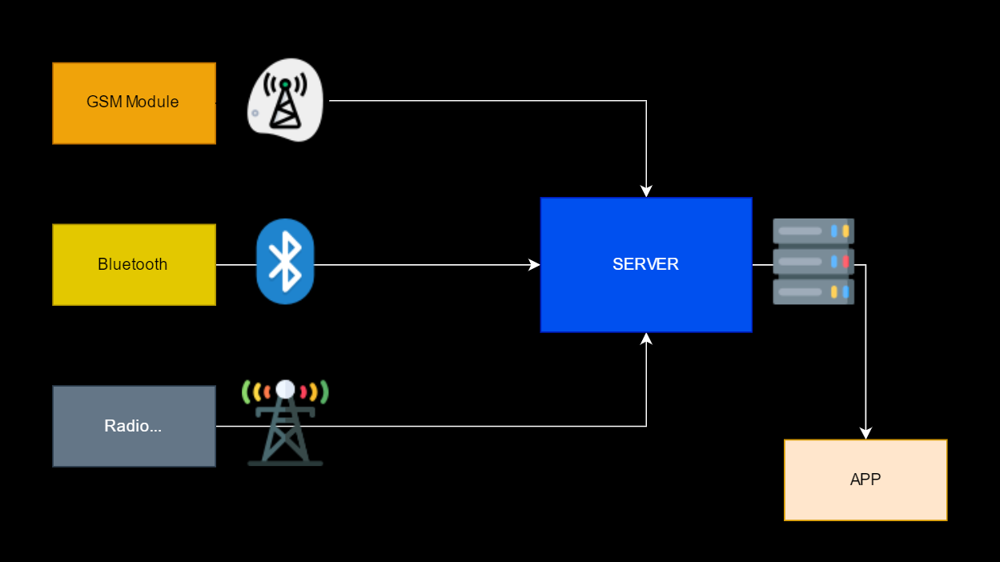

# WNet
The program sees the weather of the specified city or place. The weather of cities is parsed from the site weatheр.com, but there is also equipment based on arduino uno that transmits data from sensors to raspberry py using satellite communications, the sensors can be located in different cities. Rasppbery py here plays the role of a server that takes data from sensors and saves it. The program communicates with the server and takes data from the specified sensors using the communication protocol.
**what used**
- python 3
- css3/html5
- javaScript

**what library required**
- BS (libraris)
- socket
- eel
- requests

